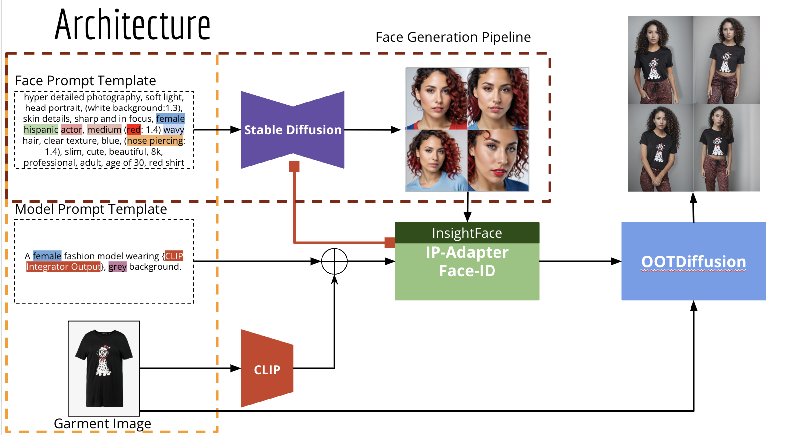
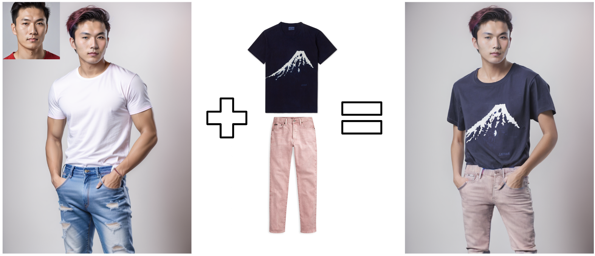
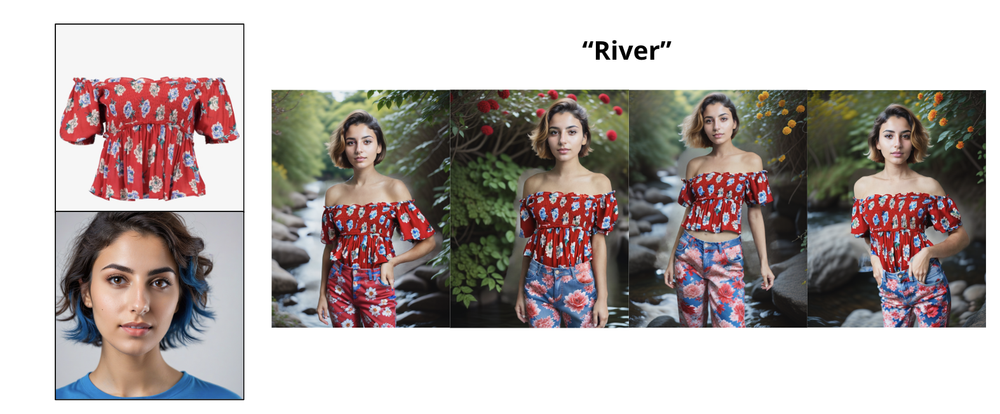
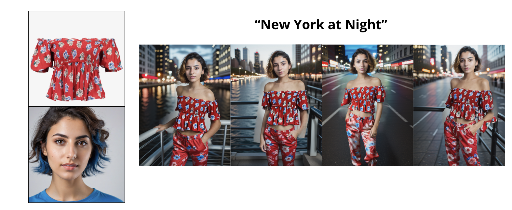

# Garment Is All You Need
This project is a class project for the Deep Learning for Computer Vision course at Georgetown University, CS Department.


**Garment is all you need** is a diffusion-based system that enables the generation of virtual try-on images using only a garment image. This system allows for the customization of the generated model images through textual prompts. Users can control various aspects such as the model's facial features, body features, and even the modeling style, setting, and environment.

### Key Components:
- **IP Adapters**: A crucial part of our system that integrates text compatibility in image prompts, facilitating precise control over the generated images.
  - Reference: Ye, Hu, Zhang, Jun, Liu, Sibo, Han, Xiao, & Yang, Wei. (2023). IP-Adapter: Text Compatible Image Prompt Adapter for Text-to-Image Diffusion Models. arXiv preprint arXiv:2308.06721.
- **OOTDiffusion**: Our core technology for outfitting fusion based latent diffusion, enabling controllable virtual try-on.
  - Reference: Xu, Yuhao, Gu, Tao, Chen, Weifeng, & Chen, Chengcai. (2024). OOTDiffusion: Outfitting Fusion based Latent Diffusion for Controllable Virtual Try-on. arXiv preprint arXiv:2403.01779.
- **CLIP Interrogator**: Utilized for refining the output by aligning it closely with the textual prompts.
  - Source: [CLIP Interrogator GitHub](https://github.com/pharmapsychotic/clip-interrogator)

Our system architecture and workflow:




### Some Experimental Results

- Full Outfit:


- Background Control:




## Installation
1. Clone the repository
    ```bash
    git clone https://github.com/levihsu/OOTDiffusion
2. Install the required packages:
    ```bash
   pip install -r equirements.txt

